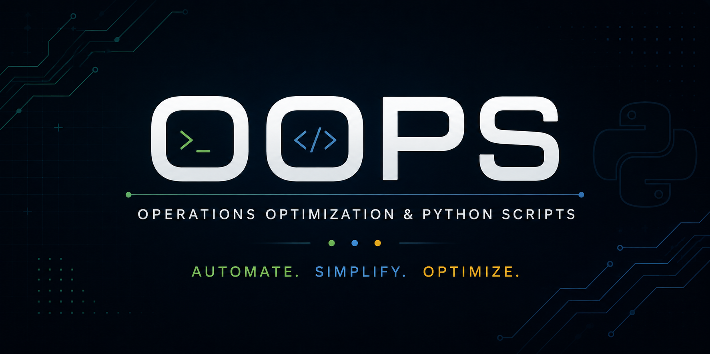

# OOPS - Operations Optimization & Python Scripts

> A curated collection of Python tools designed to automate Linux system administration tasks, eliminate repetitive work, and help system administrators manage infrastructure more efficiently.

## About

OOPS is a collection of production-inspired Python projects built around real-world system administration scenarios.

Each project starts from a practical operational problem ("ticket") and evolves into a reusable command-line tool with clean architecture, documentation, and reporting capabilities.

The goal of this repository is to:

- Learn Python through practical automation
- Solve common Linux administration tasks
- Build reusable command-line utilities
- Share production-inspired solutions with the community

---

## Projects

| Ticket | Project  | Description                 | Status        |
| ------ | -------- | --------------------------- | ------------- |
| #001   | **PEXA** | Password Expiration Auditor | [x] Completed |

---

## Ticket #001 — PEXA

PEXA (Password Expiration Auditor) automates password expiration audits across multiple Linux servers.

---

## Why OOPS?

System administrators spend a significant amount of time performing repetitive operational tasks.

Instead of executing the same commands every day, OOPS focuses on building reusable automation tools that:

- save time
- reduce human error
- improve operational visibility
- generate professional reports
- simplify infrastructure management

Every project in this repository is inspired by a realistic administration scenario.

---

**Full Documentation**

See:

**[Documentation](https://hosnizaaraoui.github.io/OOPS/)**

---

## Contributing

Ideas, improvements, bug reports, and new automation scripts are always welcome.

Feel free to open an Issue or submit a Pull Request.

---

## License

This project is licensed under the MIT License.
