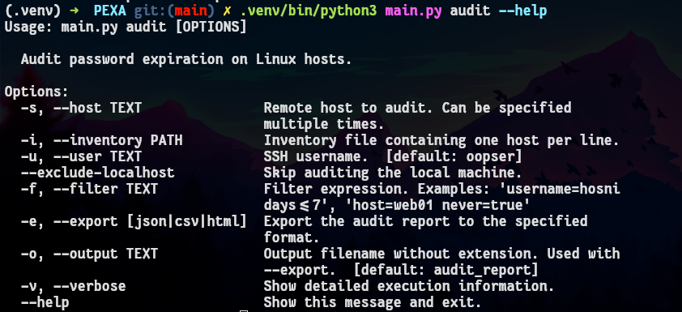
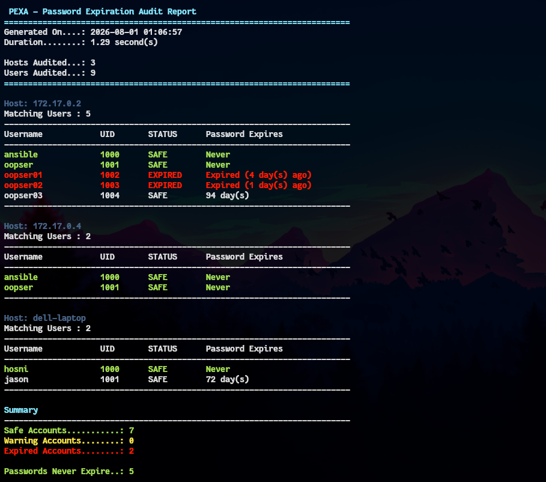
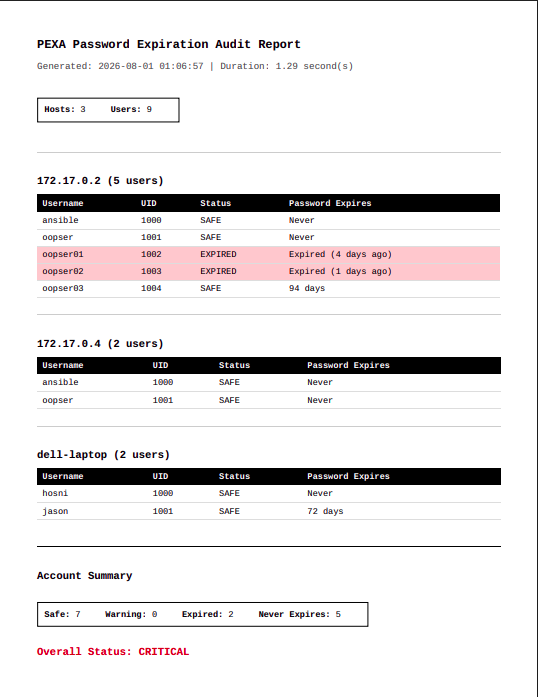
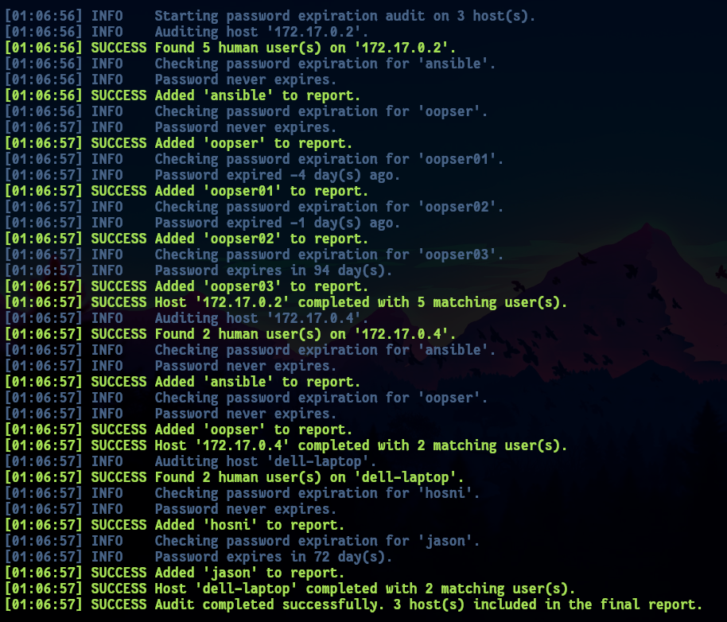

# PEXA - Password Expiration Auditor

> A Python command-line tool that audits password expiration across multiple Linux hosts, helping system administrators identify expired accounts, upcoming expirations, and generate professional reports.

---

## Overview

PEXA is the first project of the **OOPS (Operations Optimization & Python Scripts)** collection.

It was built around a realistic system administration scenario where an organization manages hundreds of Linux servers and needs a reliable way to monitor password expiration policies.

Instead of manually connecting to every server and checking user accounts, PEXA automates the entire process.

## The Scenario

Imagine you're responsible for maintaining **250 Linux servers**.

Every Monday morning, management asks for a report like this:

| Hostname | Username | Password Expires |
| -------- | -------- | ---------------- |
| web01    | nginx    | Never            |
| db01     | mysql    | Never            |
| vpn01    | hosni    | 12 day(s)        |
| mail01   | admin    | Expired          |

Doing this manually is repetitive, time-consuming, and error-prone.

PEXA performs the audit automatically and generates reports in multiple formats.

## Features

- Audit local and remote Linux hosts
- SSH support using AsyncSSH
- Inventory file support
- Automatic filtering of system accounts
- Password expiration detection
- Human-readable console reports
- Colored audit output
- Verbose execution mode
- Flexible filtering
- JSON report export
- CSV report export
- HTML report export
- Clean object-oriented architecture
- Asynchronous remote execution

## Requirements

- Python 3.12+
- Linux
- SSH access to remote hosts
- Passwordless sudo for the `chage` command (or appropriate permissions)

## Installation

Clone the repository:

```bash
git clone https://github.com/hosnizaaraoui/OOPS.git
```

Move into the project:

```bash
cd OOPS/pexa
```

Create a virtual environment:

```bash
python -m venv .venv
```

Activate it:

Linux

```bash
source .venv/bin/activate
```

Install dependencies:

```bash
pip install -r requirements.txt
```

## Inventory File

PEXA accepts an inventory file containing one host per line.

Example:

```text
172.17.0.2>oopser
172.17.0.4>oopser
```

Format

```
hostname>username
```

If the username is omitted, the value supplied with `--user` will be used.

## Usage

Audit hosts from an inventory file:

```bash
.venv/bin/python3 main.py audit --inventory inventory.txt
```

Audit a specific host:

```bash
.venv/bin/python3 main.py audit --host 192.168.1.20
```

Audit multiple hosts:

```bash
.venv/bin/python3 main.py audit \
    --host web01 \
    --host db01 \
    --host mail01
```

Specify the SSH username:

```bash
.venv/bin/python3 main.py audit \
    --inventory inventory.txt \
    --user admin
```

Exclude the local machine:

```bash
.venv/bin/python3 main.py audit \
    --inventory inventory.txt \
    --exclude-localhost
```

Enable verbose mode:

```bash
.venv/bin/python3 main.py audit \
    --inventory inventory.txt \
    --verbose
```

## Filtering

PEXA supports filtering audit results using a simple expression syntax.

Examples:

```bash
--filter "username=hosni"
```

```bash
--filter "status=expired"
```

```bash
--filter "days<7"
```

```bash
--filter "host=web01 status=warning"
```

Multiple filters can be combined.

## Exporting Reports

Generate JSON:

```bash
.venv/bin/python3 main.py audit \
    --inventory inventory.txt \
    --export json
```

Generate CSV:

```bash
.venv/bin/python3 main.py audit \
    --inventory inventory.txt \
    --export csv
```

Generate HTML:

```bash
.venv/bin/python3 main.py audit \
    --inventory inventory.txt \
    --export html
```

Generate multiple reports simultaneously:

```bash
.venv/bin/python3 main.py audit \
    --inventory inventory.txt \
    --export json \
    --export csv \
    --export html
```

Specify the output filename:

```bash
.venv/bin/python3 main.py audit \
    --inventory inventory.txt \
    --export html \
    --output weekly_report
```

This generates:

```
weekly_report.html
```

## Example Output

```text
========================================================================
 PEXA - Password Expiration Audit Report
========================================================================
Generated On....: 2026-08-01 00:35:38
Duration........: 1.27 second(s)

Hosts Audited...: 3
Users Audited...: 9
========================================================================

Host: 172.17.0.2
Matching Users : 5
------------------------------------------------------------------------
Username            UID       STATUS      Password Expires
------------------------------------------------------------------------
ansible             1000      SAFE        Never
oopser              1001      SAFE        Never
oopser01            1002      EXPIRED     Expired (4 day(s) ago)
oopser02            1003      EXPIRED     Expired (1 day(s) ago)
oopser03            1004      SAFE        94 day(s)
------------------------------------------------------------------------

Host: 172.17.0.4
Matching Users : 2
------------------------------------------------------------------------
Username            UID       STATUS      Password Expires
------------------------------------------------------------------------
ansible             1000      SAFE        Never
oopser              1001      SAFE        Never
------------------------------------------------------------------------

Host: dell-laptop
Matching Users : 2
------------------------------------------------------------------------
Username            UID       STATUS      Password Expires
------------------------------------------------------------------------
hosni               1000      SAFE        Never
jason               1001      SAFE        72 day(s)
------------------------------------------------------------------------

Summary
------------------------------------------------------------------------
Safe Accounts...........: 7
Warning Accounts........: 0
Expired Accounts........: 2

Passwords Never Expire..: 5

Overall Result........: CRITICAL

Audit completed successfully.

[00:35:38] SUCCESS JSON report written to '/home/hosni/Desktop/report.json'
```

## Screenshots

### CLI Help

{width="600"}
{ style="text-align: center" }

### Console Audit

{width="600"}
{ style="text-align: center" }

### HTML Report

{width="600"}
{ style="text-align: center" }

### Verbose Mode

{width="600"}
{ style="text-align: center" }

## Project Structure

```
pexa/

├── collectors/
├── filters/
├── hosts/
├── models/
├── reports/
├── utils/
├── main.py
└── README.md
```

## Future Improvements

Although the initial objectives have been completed, future enhancements may include:

- Parallel host execution
- Email report delivery
- YAML configuration files
- PDF report generation
- Scheduling support
- Unit tests

## Contributing

Contributions, feature requests, and ideas are always welcome.

If you have an idea for improving PEXA, feel free to open an Issue or submit a Pull Request.

## License

PEXA is part of the **OOPS (Operations Optimization & Python Scripts)** repository and is licensed under the MIT License.
